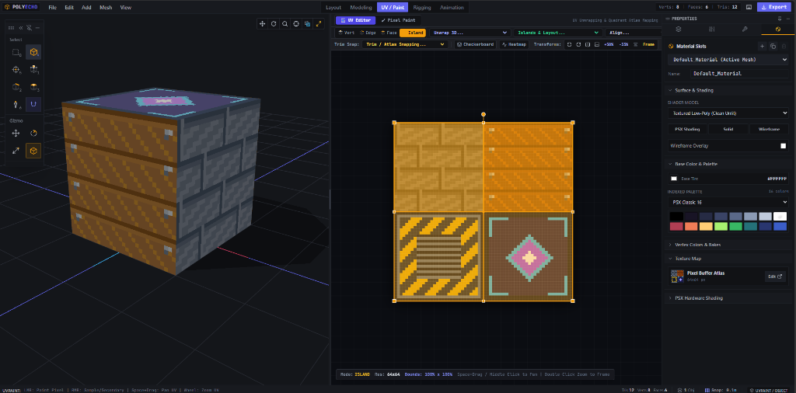

# PolyEcho

A focused, browser-based low-poly 3D modeling, UV pixel painting, and skeletal animation suite built with Vue 3, TypeScript, and Three.js.

Designed from the ground up for indie game developers, retro game creators (PS1/DS/N64 styles), and technical artists who want a fast, no-nonsense workflow without the overhead of massive DCC packages.



## Core Workflow

PolyEcho combines four integrated workspaces:

```
[ MODEL ] ➔ [ UV / PAINT ] ➔ [ RIG ] ➔ [ ANIMATE ] ➔ [ GLB / OBJ EXPORT ]
```

1. **Model**: Box modeling, quad & n-gon topology editing, Blender-style modal CAD gizmos (`G`, `R`, `S`, `E`, `I`, `Ctrl+B`, `K`, `Ctrl+R`, `Shift+A`).
2. **UV / Paint**: Interactive pixel canvas, Bayer 8x8 dithering brushes, retro color palette indexing (PSX, Pico-8, GameBoy, NES), and 3D vertex painting.
3. **Rig**: Visual bone extrusion, hierarchical joint parenting, symmetrize (L/R), and 1-click rigid limb part assignment or 4-influence smooth skinning.
4. **Animate**: Multi-action clip library (`Idle`, `Walk`, `Attack`, etc.), dope-sheet timeline, automatic/manual keyframing, pose mirroring, timeline event markers, and GLB Animator-inspired real-time clip blending.

---

## Features

### 1. Essential Low-Poly Modeling
- **Selection Modes**: Object (`4`), Origin/Pivot (`5`), Bone Mode (`6`), Vertex (`1`), Edge (`2`), Face (`3`).
- **Marquee Selection**: Perforated one-shot Box Select (`B` / `Ctrl+LMB Drag`) across 3D viewport, bones, and UV Editor.
- **Viewport Shading & X-Ray**: Clean Textured, Solid, Wireframe, Retro PSX affine/jitter shaders, and Blender-style **X-Ray Mode (`Alt+Z`)** with in-viewport glassmorphic toggle and `Z` pie menu.
- **Modal Operators**: Move (`G`), Rotate (`R`), Scale (`S`), Extrude (`E`), Inset (`I`), Bevel (`Ctrl+B`), Knife Topology (`K`), Loop Cut & Slide (`Ctrl+R`).
- **Topology Operations**:
  - Merge at Center (`M`), First, Last, and Distance (Weld).
  - Fill Face from Boundary (`F`) and Connect Vertices (`J`).
  - Dissolve Edges and Vertices.
  - Divide / Subdivide (Quads into 4 quads, edges with midpoint interpolation).
  - Flip Edge Diagonal (Rotate triangle hypotenuse).
  - Separate Selection (`P`) & Join Meshes (`Ctrl+J`).
  - Flip Face Normals & Recalculate Outside Normals.
  - Safe Mesh Cleanup (removes zero-length edges, orphan vertices, degenerate polygons).
- **Interactive CAD Placement (`Shift+A`)**: Draw primitives (Box, Plane, Cylinder, Cone, Sphere, Icosphere) directly on grids or surface geometry with snap alignment.

### 2. Retro Texture & UV Painting
- 2D Pixel Canvas with layers, flood fill, color picker, Bayer matrix dithering, and eraser.
- Automatic planar, box, and cylindrical UV unwrap solvers.
- Real-time 3D Viewport pixel painting and vertex color painting.
- Authentic retro color quantization presets.

### 3. Rigging & Part Parenting
- **Rigid Part Animation (Default)**: Assign distinct mesh objects to bones with 100% influence for robots, low-poly characters, and props.
- **Smooth Skinned Mesh**: Distance-based automatic vertex weight assignment normalized up to 4 bone influences.
- Visual joint manipulators, bone extrusion (`E`), bone subdivision, and X-axis symmetrization.

### 4. Game Animation System
- **Multiple Named Animation Clips**: Store as many clips as your game requires (`Idle`, `Walk`, `Run`, `Attack_01`, `Death`) in a single model file.
- **Timeline & Dope Sheet**: Compact expandable bone/channel tracks, frame transport controls, adjustable FPS (8, 12, 15, 24, 30, 60), and duration scaling.
- **Keyframe Tools**: Position, Rotation (quaternion slerp), Scale channels, Auto Key toggle, Copy/Paste Pose, Paste Mirrored Pose (for walking cycles).
- **Interpolation**: Smooth (`CUBICSPLINE`), Linear (`LINEAR`), and Step (`STEP` for snappy retro stop-motion animation).
- **Timeline Markers / Game Events**: Place named event flags (e.g. `footstep_l`, `hit_frame`, `land`) exported directly in GLB animation metadata.
- **Clip Blend Preview**: Live spherical blend testing between any two animation clips with percentage sliders.

### 5. Import & Export Pipeline
- **GLTF / GLB (.glb)**: Multi-animation skeletal export with bone hierarchies, rigid limb assignments, smooth skins, materials, and marker event metadata in `extras`.
- **Wavefront OBJ / MTL (.obj)**: Compatible with Blender, Godot, Unity, Unreal Engine, and custom game engines.
- **Project Files (.psxproj)**: Self-contained JSON project format with full undo/redo state history.

---

## Keyboard Shortcuts

| Shortcut | Action |
| :--- | :--- |
| `1` / `2` / `3` | Vertex / Edge / Face Select Mode |
| `4` / `5` | Object / Origin (Pivot) Mode |
| `Tab` | Toggle Object / Edit Mode |
| `G` / `R` / `S` | Move / Rotate / Scale |
| `E` / `I` | Extrude / Inset Faces |
| `Ctrl + B` | Bevel / Chamfer |
| `Ctrl + R` | Loop Cut & Slide |
| `K` | Knife Topology Tool |
| `F` | Fill Face / Bridge Loop |
| `J` | Connect 2 Selected Vertices |
| `M` | Merge Vertices Menu |
| `P` | Separate Selected Geometry to New Object |
| `Ctrl + J` | Join Selected Mesh Objects |
| `Shift + D` | Duplicate Selection |
| `Delete` / `X` | Delete Selection |
| `Shift + A` | Add Primitive Menu (at cursor) |
| `Space` | Play / Pause Timeline Animation |
| `Ctrl + Z` / `Ctrl + Y` | Undo / Redo |
| `Ctrl + S` / `Ctrl + O` | Save / Open Project |
| `Ctrl + E` | Quick Export GLB |

---

## Getting Started

### Prerequisites
- Node.js 18+
- npm / pnpm / yarn

### Installation & Run

```bash
# Clone the repository
git clone https://github.com/CharmingBlaze/polyecho.git
cd polyecho

# Install dependencies
npm install

# Start local development server
npm run dev

# Build for production
npm run build
```

Open [http://localhost:5173](http://localhost:5173) in your browser.

---

## Tech Stack
- **Framework**: Vue 3 (Composition API, `<script setup>`, TypeScript)
- **3D Engine**: Three.js
- **State Management**: Pinia
- **Styling**: Tailwind CSS
- **Icons**: Lucide Vue & Custom Blender DCC SVGs
- **Build Tool**: Vite

## License
MIT License. Free to use for personal, indie, and commercial game development.
